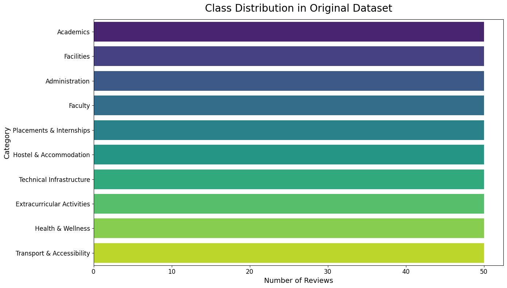
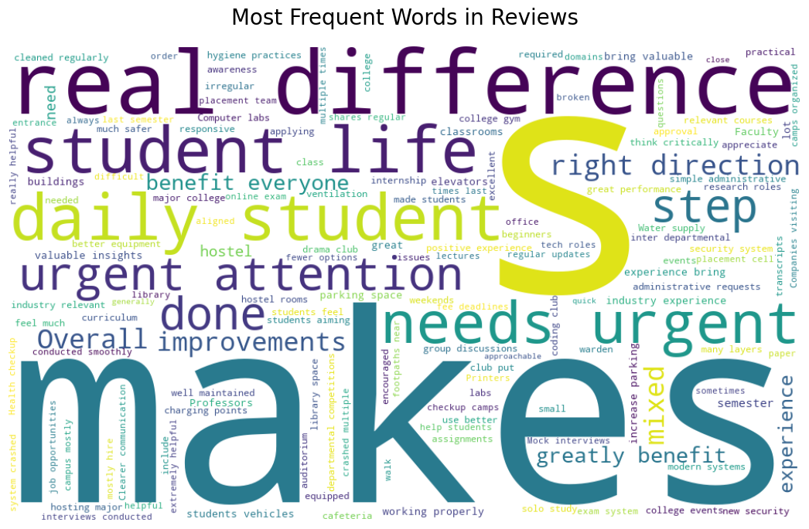
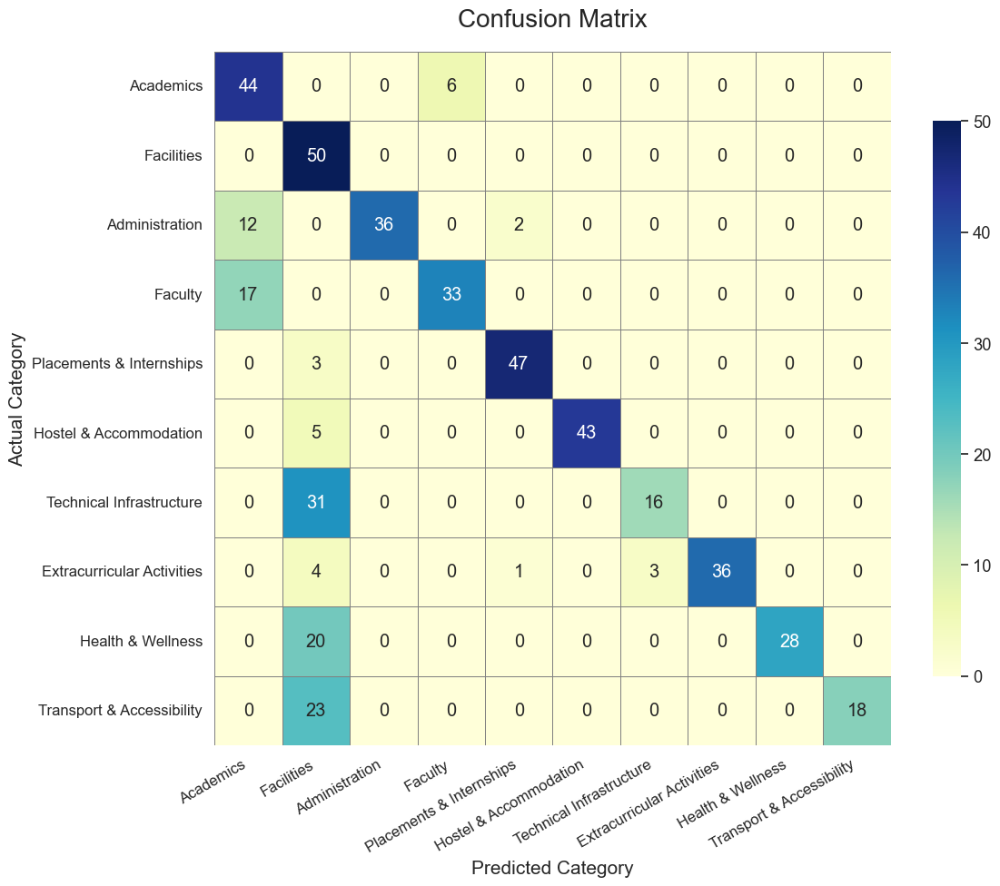
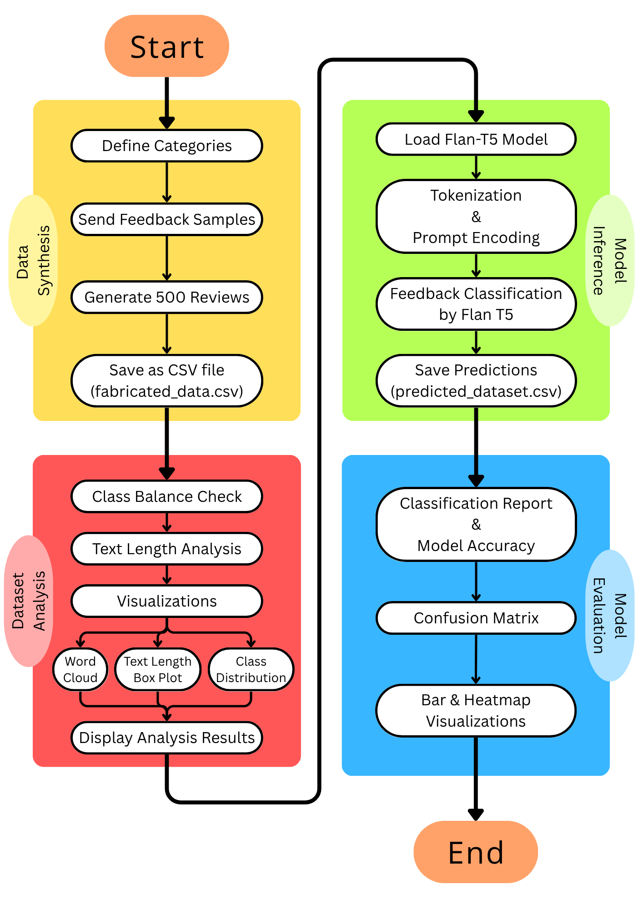

# 🎓 Student Feedback Classifier using Generative AI (FLAN-T5 + IBM Watsonx)

> 🔍 Automatically categorize student feedback into meaningful categories using a zero-shot generative AI model (FLAN-T5).  
> 📌 Built as part of the “Gen AI using IBM Watsonx” course at VIT Chennai.

---

## 📘 Overview

Student feedback is a vital resource for assessing and improving campus life, but it's often unstructured and time-consuming to analyze manually. This project leverages a **Generative AI model (Flan-T5)** to classify student reviews into ten pre-defined categories such as:

- Academics
- Faculty
- Facilities
- Administration
- Hostel & Accommodation
- Technical Infrastructure
- Extracurricular Activities
- Health & Wellness
- Transport & Accessibility
- Placements & Internships

Using a zero-shot learning approach, the model classifies feedback **without any fine-tuning** — making it flexible and easily deployable.

---

## 📊 Demo & Screenshots

> 📎 Add your generated plots, flowcharts, and output images below:

### 📂 Dataset Visualization

### 🧠 Word Cloud

### 🧪 Model Performance

### 🔁 Flowchart of the Pipeline

---

## 🛠 Tools & Technologies Used

| Tool / Library         | Purpose                              |
|------------------------|--------------------------------------|
| **Python**             | Core programming language            |
| **FLAN-T5 (Hugging Face)** | Zero-shot text classification     |
| **IBM Watsonx.ai**     | Platform for hosting model inference |
| **Pandas, CSV**        | Data wrangling and I/O               |
| **Matplotlib, Seaborn**| Visualizations & Analysis            |
| **Scikit-learn**       | Evaluation metrics                   |
| **WordCloud**          | Lexical visualization                |

---

## 🚀 Methodology

1. **Synthetic Dataset Generation**  
   Manually curated seed data was augmented with random suffixes to generate 500 realistic feedback samples (50 per category).

2. **Prompt Engineering for FLAN-T5**  
   A custom prompt was designed to instruct the model to classify the review text into one of the 10 categories.

3. **Model Inference (Zero-Shot)**  
   FLAN-T5 generated predictions from the prompt without any further training.

4. **Postprocessing & Evaluation**  
   Model outputs were cleaned, categorized, and compared against ground-truth values using classification metrics and confusion matrices.

---

## 📈 Results

- **Overall Accuracy**: ~86%  
- **Balanced performance** across all categories  
- **Strong generalization** with zero-shot prompting  
- Visual analysis using word clouds and bar charts further validated semantic coverage

---

## 🧩 Challenges & Solutions

| Challenge | Solution |
|----------|----------|
| No real-world labeled data | Generated synthetic dataset using intelligent augmentation |
| Prompt inconsistency | Used standardized and templated prompt format |
| Output noise from model | Implemented postprocessing to match predictions to valid labels |
| Multi-class evaluation complexity | Used `classification_report` and visualized confusion matrix |

---

## 📁 Project Links

- 🔗 [GitHub Repository](https://github.com/SushenGrover/Student-Feedback-Classifier-GenAI)  
- 🔗 [Google Colab Notebook](https://colab.research.google.com/drive/1PFfxIsjveHeGLMta3X7ekNWC1MFhrBD7?usp=sharing)

---

## 📌 Future Improvements

- Use real institutional feedback for fine-tuning
- Expand to multilingual feedback classification
- Deploy as a web-based tool for real-time use

---

## 📜 License

This project is licensed under the MIT License.

---

## 🙌 Acknowledgements

- **VIT Chennai** – For providing academic guidance  
- **IBM Watsonx** – For hosting generative AI models  
- **Hugging Face** – For FLAN-T5 and transformer libraries

---

## 📚 References

- [FLAN-T5 on Hugging Face](https://huggingface.co/google/flan-t5-base)  
- [Scikit-learn Documentation](https://scikit-learn.org/stable/)  
- [Prompt Engineering Guide](https://github.com/dair-ai/Prompt-Engineering-Guide)  
- [WordCloud for Python](https://github.com/amueller/word_cloud)

---

> ✨ Made with dedication by **Sushen Grover** (Reg. No. 23BCE1728), VIT Chennai.
